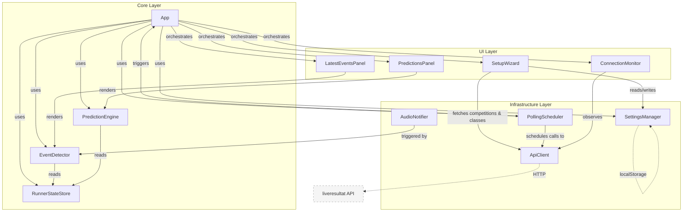
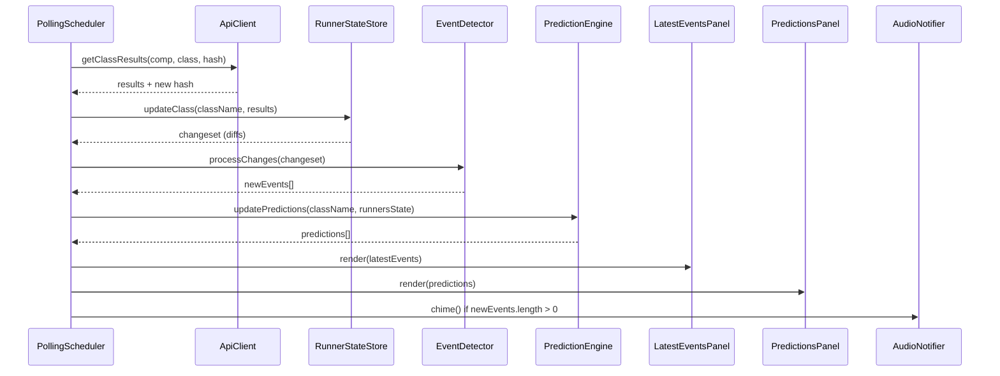

# Architecture Overview

## Design Principles

- **Modern modular JavaScript** — ES modules, no framework, no build step required
- **Tiny footprint** — vanilla JS, CSS custom properties, Web Audio API, no dependencies
- **Resilient** — state persisted in `localStorage`; survives reloads and network drops
- **Readable at distance** — large fonts, high contrast, designed for ≥ Full HD at 1 m+

## Component Diagram



## Data Flow



## Module Map

| Module | File | Purpose |
|--------|------|---------|
| App | `js/app.js` | Entry point, orchestration |
| ApiClient | `js/api-client.js` | HTTP layer with caching & circuit breaker |
| PollingScheduler | `js/polling-scheduler.js` | Timed polling with staggered requests |
| SettingsManager | `js/settings-manager.js` | Persistent settings via localStorage |
| RunnerStateStore | `js/runner-state-store.js` | Runner state tracking & change detection |
| EventDetector | `js/event-detector.js` | Detects events from state diffs |
| PredictionEngine | `js/prediction-engine.js` | Computes predicted split/finish times |
| LatestEventsPanel | `js/latest-events-panel.js` | Renders latest events list with animation |
| PredictionsPanel | `js/predictions-panel.js` | Renders predictions list |
| ConnectionMonitor | `js/connection-monitor.js` | Network health indicator |
| AudioNotifier | `js/audio-notifier.js` | Plays chime via Web Audio API |
| SetupWizard | `js/setup-wizard.js` | Competition/class/club selection UI |

## File Structure

```
/
├── index.html
├── css/
│   └── styles.css
├── js/
│   ├── app.js
│   ├── api-client.js
│   ├── polling-scheduler.js
│   ├── settings-manager.js
│   ├── runner-state-store.js
│   ├── event-detector.js
│   ├── prediction-engine.js
│   ├── latest-events-panel.js
│   ├── predictions-panel.js
│   ├── connection-monitor.js
│   ├── audio-notifier.js
│   └── setup-wizard.js
└── docs/
    ├── architecture.md
    └── components/
        ├── app.md
        ├── api-client.md
        ├── polling-scheduler.md
        ├── settings-manager.md
        ├── runner-state-store.md
        ├── event-detector.md
        ├── prediction-engine.md
        ├── latest-events-panel.md
        ├── predictions-panel.md
        ├── connection-monitor.md
        ├── audio-notifier.md
        └── setup-wizard.md
```
